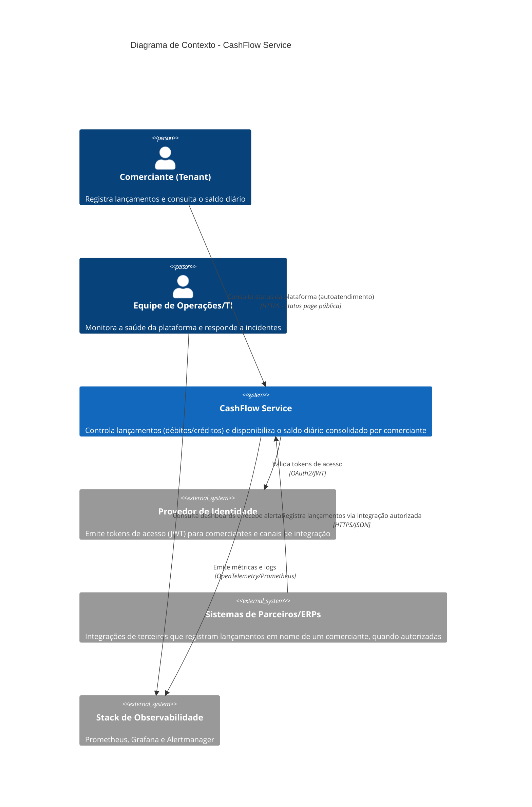

# Diagrama de Contexto

Visão geral do sistema no contexto de seus usuários e sistemas externos.

```mermaid
C4Context
    title Diagrama de Contexto - CashFlow Service

    Person(lojista, "Comerciante (Tenant)", "Registra lançamentos e consulta o saldo diário")
    Person(operacao, "Equipe de Operações/TI", "Monitora a saúde da plataforma e responde a incidentes")

    System(plataforma, "CashFlow Service", "Controla lançamentos (débitos/créditos) e disponibiliza o saldo diário consolidado por comerciante")

    System_Ext(idp, "Provedor de Identidade", "Emite tokens de acesso (JWT) para comerciantes e canais de integração")
    System_Ext(parceiro, "Sistemas de Parceiros/ERPs", "Integrações de terceiros que registram lançamentos em nome de um comerciante, quando autorizadas")
    System_Ext(observabilidade, "Stack de Observabilidade", "Prometheus, Grafana e Alertmanager")

    Rel(lojista, plataforma, "Registra lançamentos e consulta saldo diário", "HTTPS/JSON")
    Rel(parceiro, plataforma, "Registra lançamentos via integração autorizada", "HTTPS/JSON")
    Rel(plataforma, idp, "Valida tokens de acesso", "OAuth2/JWT")
    Rel(operacao, observabilidade, "Consulta dashboards e recebe alertas")
    Rel(plataforma, observabilidade, "Emite métricas e logs", "OpenTelemetry/Prometheus")
    Rel(lojista, plataforma, "Consulta status da plataforma (autoatendimento)", "HTTPS - status page pública")
```
